# Perfin - Personal Finance Manager 💰

<div align="center">
  
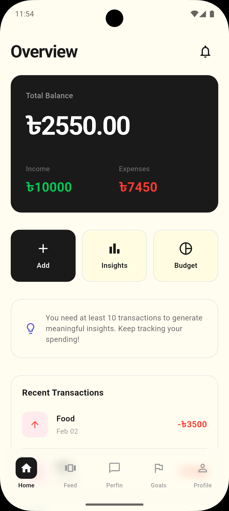

**A powerful, AI-powered personal finance management app built with Flutter**

[](https://flutter.dev)
[](https://dart.dev)
[](LICENSE)

[Features](#-features) • [Screenshots](#-screenshots) • [Installation](#-installation) • [Tech Stack](#-tech-stack)

</div>

---

## 📱 About

Perfin is a modern, intuitive personal finance management application that helps you take control of your finances. With powerful AI insights, beautiful UI, and comprehensive tracking features, managing your money has never been easier.

## ✨ Features

### 💸 Smart Transaction Management
- **Quick Entry**: Add income and expenses in seconds
- **Categories**: Organize transactions with predefined and custom categories
- **Multi-Currency Support**: Track finances in 9+ currencies (USD, EUR, GBP, BDT, INR, JPY, CNY, AUD, CAD)
- **Transaction History**: View and filter all your financial activities

### 📊 Budget & Goals
- **Budget Planning**: Set monthly budgets by category
- **Real-time Tracking**: Monitor spending against budgets with visual indicators
- **Savings Goals**: Create and track savings goals with progress charts
- **Goal Analysis**: AI-powered feasibility analysis for your financial goals
- **Smart Alerts**: Get notified when approaching budget limits

### 🤖 AI-Powered Insights
- **Perfin AI Copilot**: Chat with AI about your finances
- **Spending Patterns**: Discover recurring expenses and unusual spending
- **Smart Predictions**: Get future spending forecasts
- **Personalized Tips**: Receive tailored financial advice
- **Goal Prioritization**: AI helps prioritize your savings goals

### 📈 Analytics & Insights
- **Visual Dashboard**: Beautiful charts and graphs
- **Monthly Summaries**: Track income vs expenses
- **Category Breakdown**: See where your money goes
- **Spending Trends**: Analyze patterns over time
- **Custom Reports**: Generate detailed financial reports

### 🎨 Beautiful UI/UX
- **Modern Design**: Clean, intuitive interface with smooth animations
- **Dark/Light Themes**: Choose your preferred visual style
- **Responsive Layout**: Optimized for phones, tablets, and desktop
- **Lottie Animations**: Engaging micro-interactions
- **Accessibility**: Built with accessibility in mind

### 🔐 Security & Privacy
- **Secure Authentication**: Email/password with session management
- **Local Storage**: Sensitive data stored locally with Hive
- **Cloud Sync**: Optional cloud synchronization
- **Privacy Controls**: Granular permission settings
- **Data Encryption**: Protected financial information

### 🔔 Smart Notifications
- **Budget Alerts**: Get notified when spending exceeds limits
- **Goal Reminders**: Stay on track with your savings goals
- **Recurring Expenses**: Never miss a recurring payment
- **Custom Notifications**: Configure alerts based on your preferences

## 🖼️ Screenshots

<div align="center">

### Onboarding & Authentication
<table>
  <tr>
    <td></td>
    <td></td>
    <td>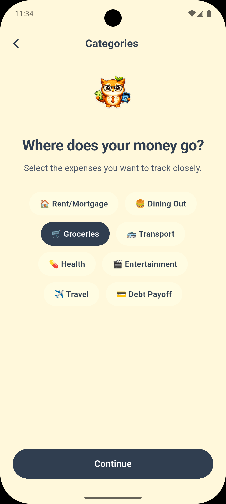</td>
    <td>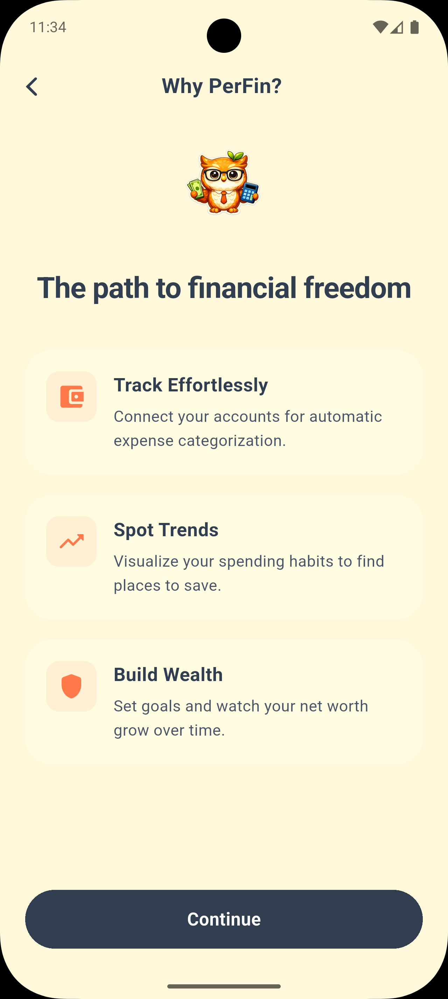</td>
  </tr>
  <tr>
    <td align="center"><b>Welcome</b></td>
    <td align="center"><b>Features</b></td>
    <td align="center"><b>Setup</b></td>
    <td align="center"><b>Permissions</b></td>
  </tr>
</table>

<table>
  <tr>
    <td></td>
    <td>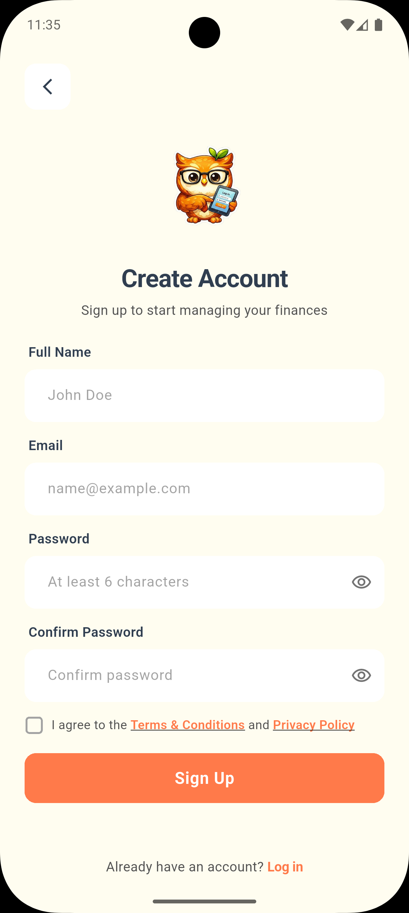</td>
  </tr>
  <tr>
    <td align="center"><b>Login</b></td>
    <td align="center"><b>Sign Up</b></td>
  </tr>
</table>

### Dashboard & Transactions
<table>
  <tr>
    <td></td>
    <td>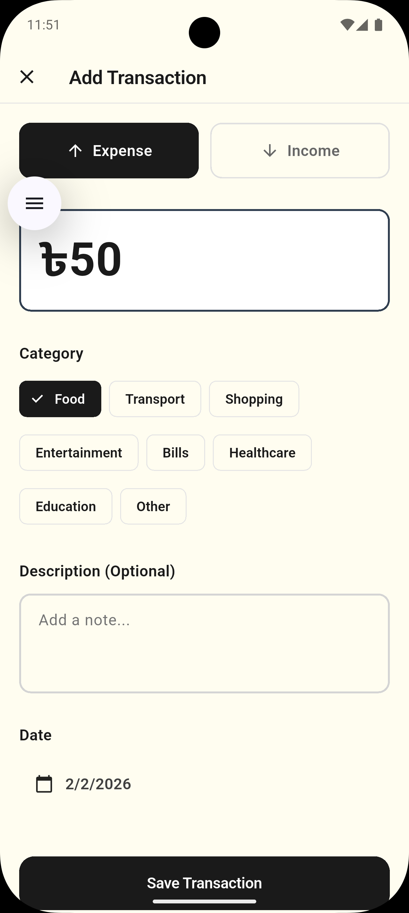</td>
    <td>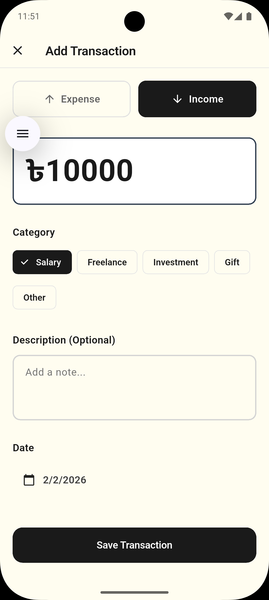</td>
  </tr>
  <tr>
    <td align="center"><b>Dashboard</b></td>
    <td align="center"><b>Add Expense</b></td>
    <td align="center"><b>Add Income</b></td>
  </tr>
</table>

### Feed & Analytics
<table>
  <tr>
    <td>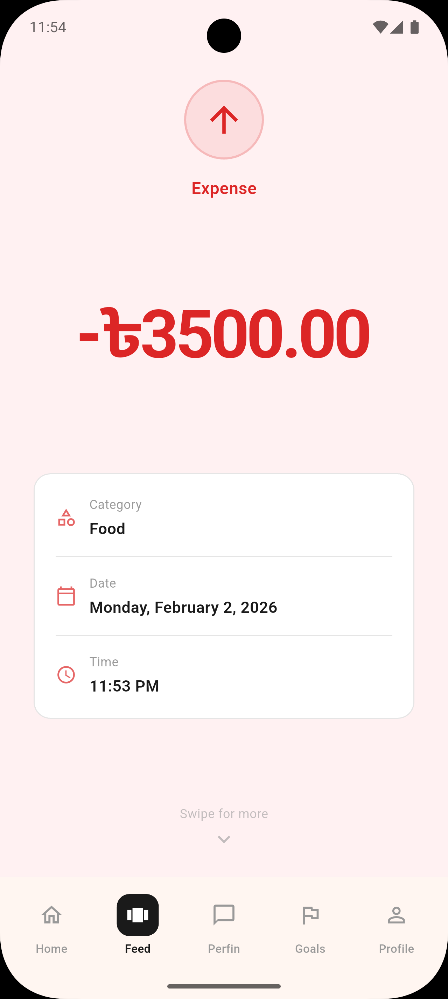</td>
    <td>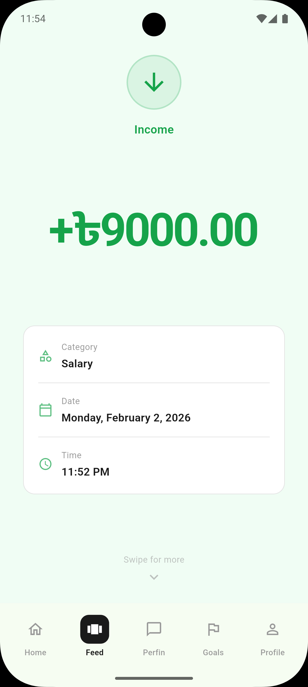</td>
    <td>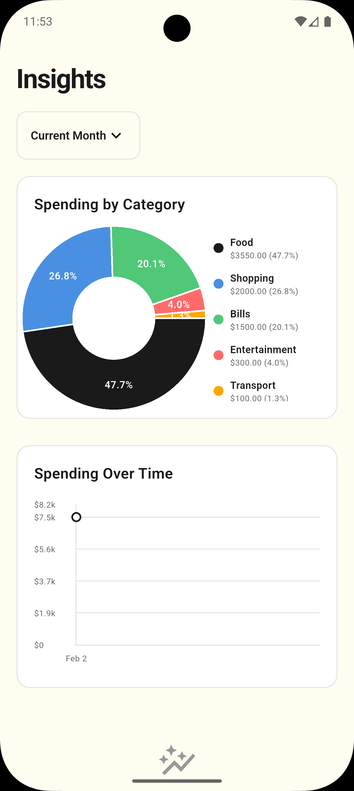</td>
  </tr>
  <tr>
    <td align="center"><b>Expense Feed</b></td>
    <td align="center"><b>Income Feed</b></td>
    <td align="center"><b>Analytics</b></td>
  </tr>
</table>

### Goals Management
<table>
  <tr>
    <td>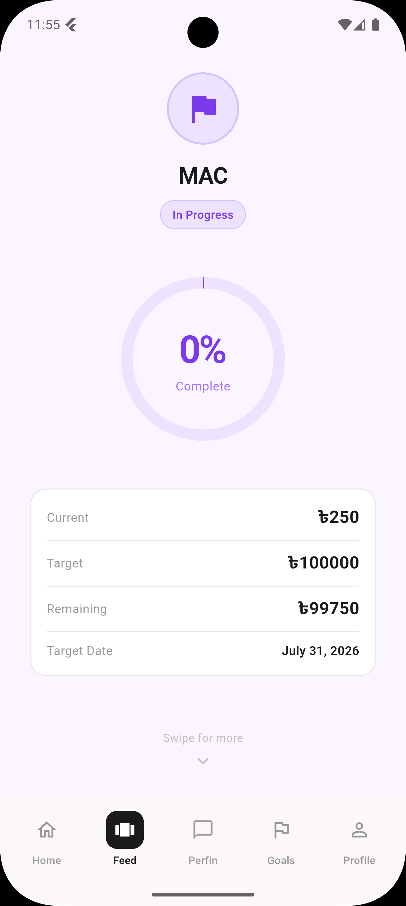</td>
    <td>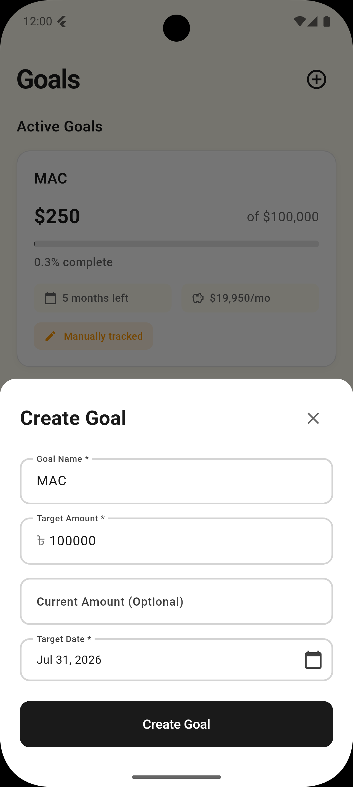</td>
    <td>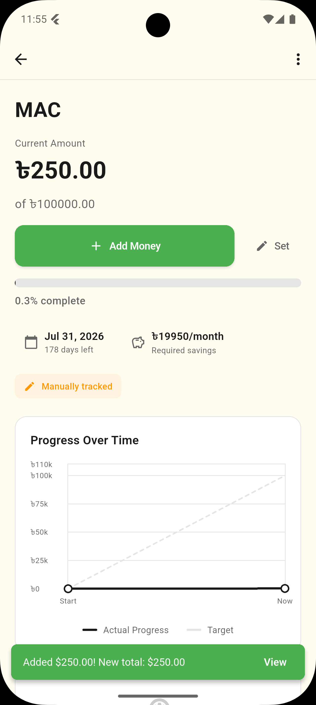</td>
    <td>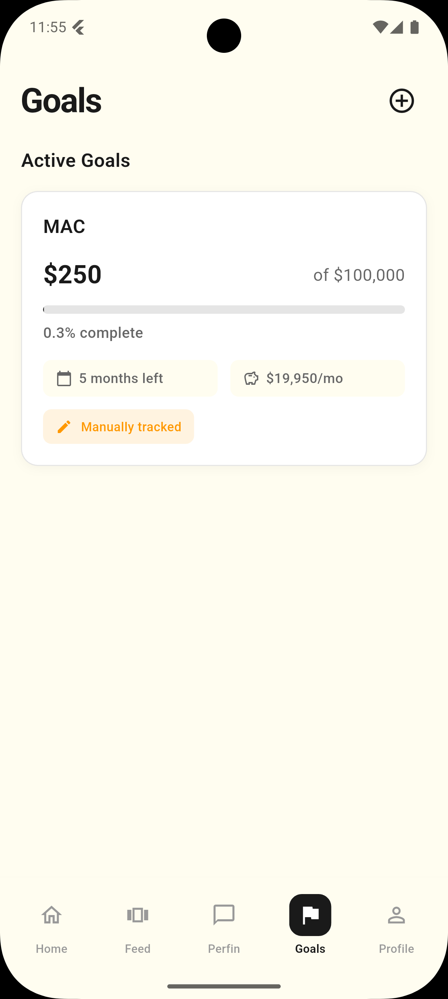</td>
  </tr>
  <tr>
    <td align="center"><b>Goals List</b></td>
    <td align="center"><b>Create Goal</b></td>
    <td align="center"><b>Goal Details</b></td>
    <td align="center"><b>Progress Chart</b></td>
  </tr>
</table>

### Budget & AI Features
<table>
  <tr>
    <td>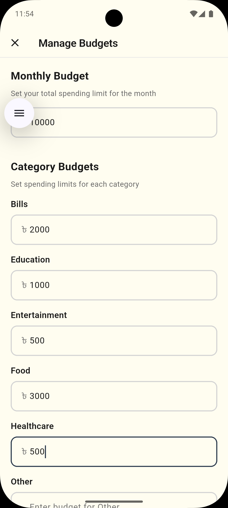</td>
    <td>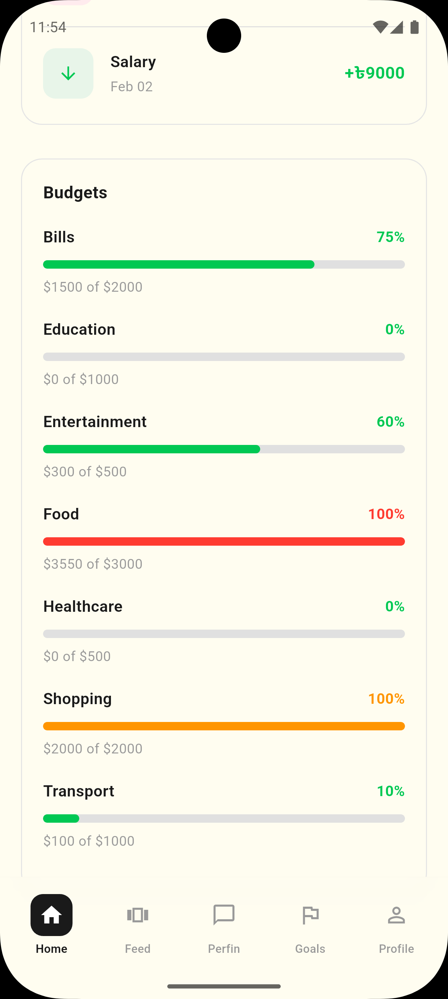</td>
    <td>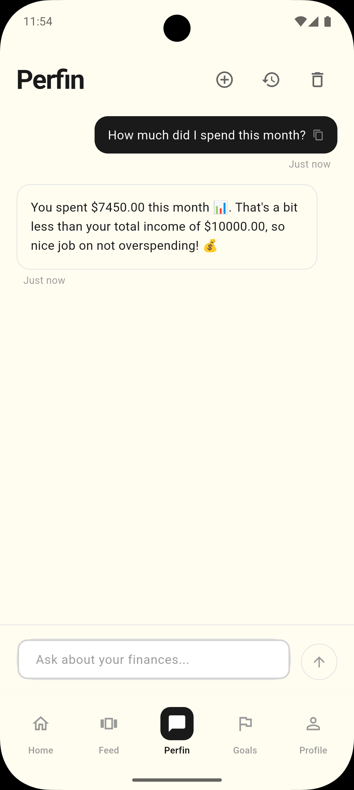</td>
    <td>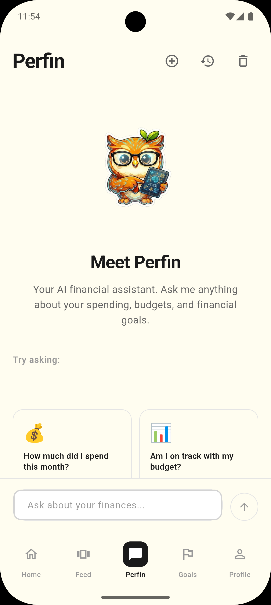</td>
  </tr>
  <tr>
    <td align="center"><b>Budget Planning</b></td>
    <td align="center"><b>Budget vs Goals</b></td>
    <td align="center"><b>AI Chat</b></td>
    <td align="center"><b>AI Insights</b></td>
  </tr>
</table>

### Profile & Settings
<table>
  <tr>
    <td>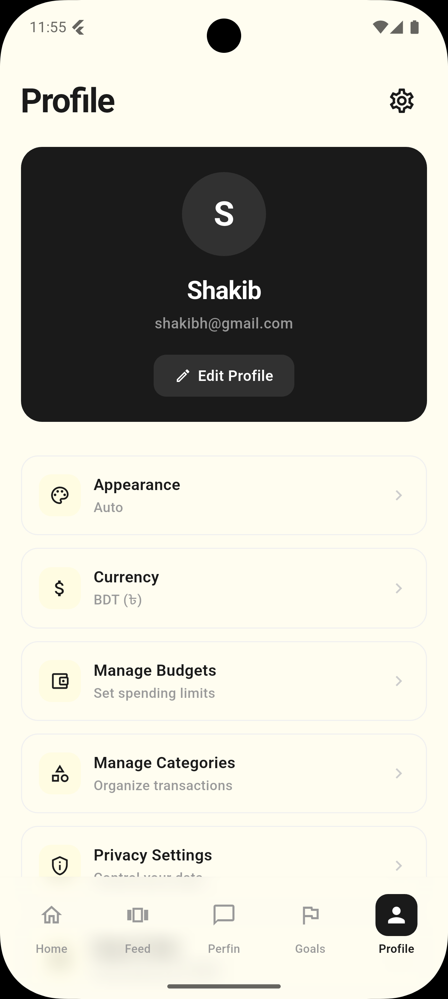</td>
    <td>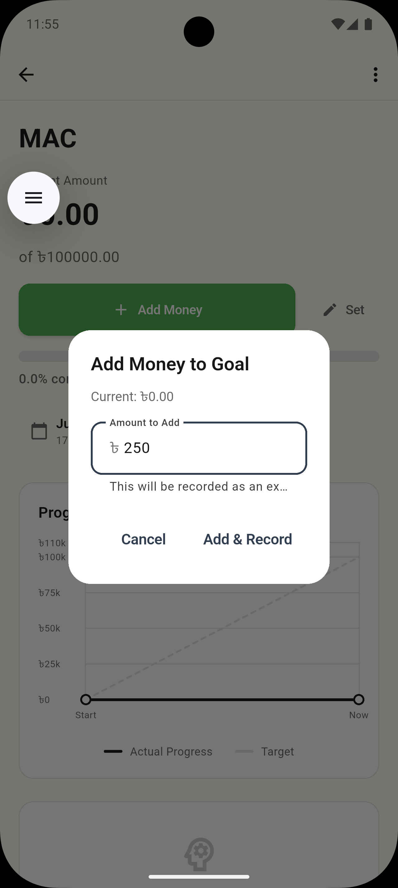</td>
  </tr>
  <tr>
    <td align="center"><b>Profile</b></td>
    <td align="center"><b>Add Money</b></td>
  </tr>
</table>

</div>

## 🚀 Installation

### Prerequisites

- Flutter SDK (3.10.4 or higher)
- Dart SDK (3.0+)
- Android Studio / Xcode (for mobile)
- Git

### Setup

1. **Clone the repository**
   ```bash
   git clone https://github.com/mr-shakib/Perfin.git
   cd Perfin
   ```

2. **Install dependencies**
   ```bash
   flutter pub get
   ```

3. **Set up environment variables**
   
   Create a `.env` file in the root directory:
   ```env
   GEMINI_API_KEY=your_gemini_api_key_here
   ```
   
   Get your Gemini API key from [Google AI Studio](https://makersuite.google.com/app/apikey)

4. **Run the app**
   ```bash
   flutter run
   ```

## 🏗️ Tech Stack

### Frontend
- **Flutter** - Cross-platform UI framework
- **Dart** - Programming language
- **Provider** - State management
- **FL Chart** - Beautiful charts and graphs
- **Lottie** - Smooth animations

### AI & Backend
- **Google Gemini AI** - AI-powered insights and chat
- **Hive** - Fast, lightweight local database
- **Shared Preferences** - Settings storage

### Key Packages
```yaml
dependencies:
  flutter_dotenv: ^5.1.0      # Environment variables
  provider: ^6.1.1             # State management
  hive: ^2.2.3                 # Local database
  hive_flutter: ^1.1.0         # Hive for Flutter
  fl_chart: ^0.66.0            # Charts
  intl: ^0.19.0                # Internationalization
  lottie: ^3.1.0               # Animations
  uuid: ^4.3.3                 # Unique IDs
  google_generative_ai: ^0.2.2 # Gemini AI
  flutter_local_notifications: ^17.1.2 # Notifications
```

## 📁 Project Structure

```
lib/
├── config/              # App configuration
│   ├── supabase_config.dart
│   └── theme_config.dart
├── constants.dart       # Global constants
├── main.dart           # App entry point
├── models/             # Data models
│   ├── transaction.dart
│   ├── budget.dart
│   ├── goal.dart
│   ├── ai_summary.dart
│   └── ...
├── providers/          # State management
│   ├── auth_provider.dart
│   ├── transaction_provider.dart
│   ├── budget_provider.dart
│   ├── goal_provider.dart
│   ├── ai_provider.dart
│   ├── currency_provider.dart
│   └── ...
├── screens/            # UI screens
│   ├── auth/           # Login, signup
│   ├── home/           # Dashboard
│   ├── transactions/   # Transaction management
│   ├── goals/          # Goals tracking
│   ├── insights/       # Analytics
│   ├── copilot/        # AI chat
│   ├── profile/        # Settings
│   └── onboarding/     # First-time setup
├── services/           # Business logic
│   ├── auth_service.dart
│   ├── transaction_service.dart
│   ├── budget_service.dart
│   ├── goal_service.dart
│   ├── ai_service.dart
│   ├── notification_service.dart
│   ├── storage_service.dart
│   └── ...
├── theme/              # App theming
│   ├── app_colors.dart
│   └── app_theme.dart
├── utils/              # Utilities
│   └── calculation_utils.dart
├── validators/         # Input validation
│   └── validation_result.dart
└── widgets/            # Reusable components
```

## 🔧 Configuration

### Currency Settings
The app supports multiple currencies. Users can change their preferred currency from:
- Profile → Settings → Currency

Supported currencies:
- USD ($) - US Dollar
- EUR (€) - Euro
- GBP (£) - British Pound
- BDT (৳) - Bangladeshi Taka
- INR (₹) - Indian Rupee
- JPY (¥) - Japanese Yen
- CNY (¥) - Chinese Yuan
- AUD (A$) - Australian Dollar
- CAD (C$) - Canadian Dollar

### AI Features
To use AI-powered insights:
1. Get a free API key from [Google AI Studio](https://makersuite.google.com/app/apikey)
2. Add it to your `.env` file
3. Enable AI features in Privacy Settings

## 🧪 Testing

```bash
# Run all tests
flutter test

# Run with coverage
flutter test --coverage

# Run specific test file
flutter test test/unit/utils/calculation_utils_test.dart
```

## 📦 Building

### Android APK
```bash
flutter build apk --release
```

### Android App Bundle
```bash
flutter build appbundle --release
```

### iOS
```bash
flutter build ios --release
```

### Web
```bash
flutter build web --release
```

### Desktop (Windows/macOS/Linux)
```bash
flutter build windows --release
flutter build macos --release
flutter build linux --release
```

## 🎯 Features Roadmap

- [x] Transaction tracking
- [x] Budget management
- [x] Savings goals
- [x] AI-powered insights
- [x] Multi-currency support
- [x] Spending analytics
- [x] Custom notifications
- [ ] Bank account integration
- [ ] Investment tracking
- [ ] Bill reminders
- [ ] Receipt scanning
- [ ] Export to CSV/PDF
- [ ] Family sharing
- [ ] Web dashboard
- [ ] Cryptocurrency tracking

## 🤝 Contributing

Contributions are welcome! Here's how you can help:

1. Fork the repository
2. Create your feature branch (`git checkout -b feature/AmazingFeature`)
3. Commit your changes (`git commit -m 'Add some AmazingFeature'`)
4. Push to the branch (`git push origin feature/AmazingFeature`)
5. Open a Pull Request

Please ensure your code follows the existing style and includes appropriate tests.

## 📄 License

This project is licensed under the MIT License - see the [LICENSE](LICENSE) file for details.

## 👨‍💻 Developer

**Shakib**
- GitHub: [@mr-shakib](https://github.com/mr-shakib)
- Repository: [Perfin](https://github.com/mr-shakib/Perfin.git)

## 🙏 Acknowledgments

- Flutter team for the amazing framework
- Google Gemini AI for intelligent insights
- The open-source community for excellent packages
- All contributors and users

## 📞 Support

If you find this project helpful, please give it a ⭐️!

For issues and feature requests, please use the [GitHub Issues](https://github.com/mr-shakib/Perfin/issues) page.

---

<div align="center">

**Made with ❤️ using Flutter**

[⬆ Back to Top](#perfin---personal-finance-manager-)

</div>
